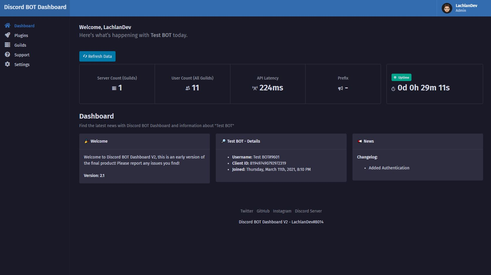

<h1 align="center">
    <br>
    <p>Discord BOT Dashboard - V2</p>

    
[](https://GitHub.com/LachlanDev/Discord-BOT-Dashboard-V2/releases/) [](https://GitHub.com/LachlanDev/Discord-BOT-Dashboard-V2/releases/) [](https://GitHub.com/LachlanDev/Discord-BOT-Dashboard-V2/issues/) [](https://discord.com/invite/w7B5nKB)


</h1>

# 📚 About
Discord BOT Dashboard V2 is the successor of <a href="https://github.com/LachlanDev/Discord-BOT-Dashboard" target="_blank">Discord BOT Dashboard</a>, Discord BOT Dashboard V2 is made to make **Discord BOT Development** easy, designed to create applications without having to write a single line of code while using a user friendly Web-Dashboard!

# Dashboard Preview:


## 🚀 Installation / Setup
Head over to the Docs to find all the instructions for setting up and running Discord BOT Dashboard V2. This can be found [here!](https://dbd.lachlan-dev.com/docs/) 
#### ⌚ Installing Requirements
Download the latest version from [Releases](https://github.com/LachlanDev/Discord-BOT-Dashboard-V2/releases), open up the root directory and run the following command.
```bash
npm install
```

#### 🖥️ Setting up BOT
Rename ``config.default.json`` to ``config.json`` and open up the file, this can be found found in the **config** folder and input the required fields. More info on these fields can be found on the Docs page [here!](https://dbd.lachlan-dev.com/docs/)
```json
{
    "clientID":"BOTclientID",
    "clientSecret":"BOTclientSecret",
    "callbackURL":"BOTcallbackURL",
    "Admin":["userAdminID"],
    "token":"BOTtoken",
    "prefix":"-",
    "port":"3000"
}
```
Make sure to enable both "Privileged Gateway Intents" on the [**Discord Developer Dashboard**](https://discord.com/developers). This is to fix errors  with "Kick / Ban" Commands!

#### 📡 Starting the application 
Open up the root directory and run the following command.
```bash
node index.js
```
You should now be able to access the dashboard at **http://localhost:3000**.

## 🧰 Features
A list of some of the features that are included in Discord BOT Dashboard V2
* 🔐 **Authentication** - Discord BOT Dashboard is locked with a secure authentication method that only allows users who are added into the config file to access the dashboard.
* 🔒 **Security** - Discord BOT Dashboard ensures that your application is secure.
* 💎 **Modern UI** - Discord BOT Dashboard is built with a modern UI to ensure its ease of use for anyone.
* 🖥️ **Open Source** - Discord BOT Dashboard is an open source project meaning anyone can contribute to make it even better.
* 🔌 **Stability** - Running your application using Discord BOT Dashboard ensures that it is stable and you wont have any errors.
* ⏲️ **24/7 Uptime** - Running you application using Discord BOT Dashboard allows you to have 24/7 uptime.
* ⛏️ **Multiple Tools** - Discord BOT Dashboard is packed with multiple tools that are easy to use.
* 🔌 **Plugins** - Develop and share plugins that can be imported into your project.

## 💡 Contribute
If you would like to contribute to the project please open a PR (Pull Request) clearly showing your changes.

## 🔒 Requirements
* [Node.JS](https://nodejs.org/en/) (v12.3.1 or later)

## 📞 Issues
If you have any issues feel free to open an issue or join the [Discord Server.](https://discord.com/invite/w7B5nKB)

## 🧲 Extra
__Created by LachlanDev#8014__
* [Website](https://lachlan-dev.com)
* [Twitter](https://twitter.com/LachlanDev)
* [Instagram](https://www.instagram.com/LachlanDev/)
* [Discord Server](https://discord.com/invite/w7B5nKB)
* [Marketplace](https://github.com/LachlanDev/Discord-BOT-Dashboard-Marketplace)
</br>
